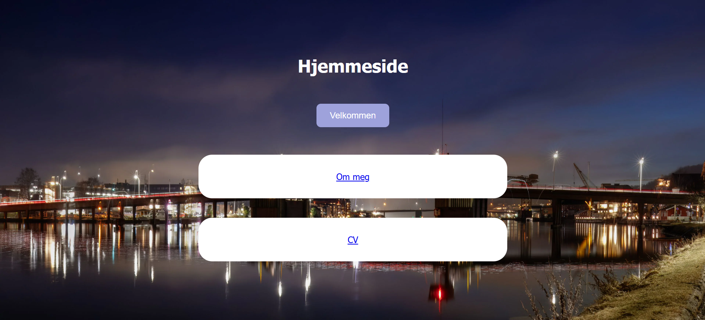

# Min CV


Dette er min personlige CV-nettside laget i forbindelse med Øving 1.

## Om prosjektet

Nettsiden presenterer informasjon om meg, min utdanning, erfaring og ferdigheter.

## Teknologier

Jeg har brukt:

- **HTML**
- **CSS**
- **JavaScript**

## Filstruktur

| Fil | Beskrivelse |
|---|---|
| `index.html` | Hovedsiden til oppgaven |
| `about.html` | Side med kort introduksjon om meg |
| `cv.html` | Side med CV-en |
| `style.css` | Styling og layout |
| `README.md` | Informasjon om prosjektet |
| `LICENSE` | MIT-lisens |

## Skjermbilde



## Kom i gang

For å åpne nettsiden lokalt:

1. Last ned prosjektet.
2. Åpne prosjektmappen i VS Code.
3. Åpne `home.html` i nettleseren.

Du kan også starte en lokal server:

```bash
python -m http.server
```

## Live demo

[Se CV-en min på nett](https://maithanhnguyen06.github.io/CV/)
